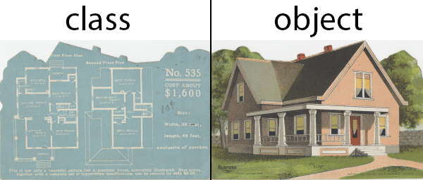

# Week 3 Notes
## Mocha & Chai
When it comes to unit testing in Javascript, there are a number of tools that make it easy to understand and implement! In this reading, we will go over how we can use the `mocha` and `chai` packages to write automated tests for Javascript.

### BDD
*BDD* or *Behavior Driven Development* is a process that emerged from test-driven development in 2006. The topic of BDD covers the entire life cycle of the app development process, from planning the project to writing the code.

### Automated Testing
Automated testing is the practice of writing code to programmatically test the actual code we want to write.

### Types of Testing
- Unit Testing
> Unit testing is the practice of testing small pieces of code, typically individual functions, alone and isolated. If your test uses some external resource, like the network or a database, it’s not a unit test. 
- Intergration Testing
> As the name suggests, in integration testing the idea is to test how parts of the system work together – the integration of the parts. Integration tests are similar to unit tests, but there’s one big difference: while unit tests are isolated from other components, integration tests are not. For example, a unit test for database access code would not talk to a real database, but an integration test would.
- Functional Testing (E2E)
> Functional testing is defined as the testing of complete functionality of some application. In practice with web apps, this means using some tool to automate a browser, which is then used to click around on the pages to test the application.

### Happy Path Testing
What is a "happy path" test? "Happy path" tests are very useful, because they catch the most critical bugs, but are definitely not sufficient for building reliable and robust applications.

## Object Oriented Javascript
**Object Orientation**, commonly abbreviated "OO", is probably the biggest concept in software development philosophy of the last thirty years. Some of the most popular languages today like Ruby, Java, and C# have been designed mainly for **Object Oriented Programming**, or "OOP". But what is Object Orientation?

- OO is a software development paradigm
- OO is a popular way to solve code organization, re-use and modularity
- OO is very important to learn due to its popularity
- JavaScript is not strictly OO in the way that Java or Ruby are
- Functional Programming is an alternative paradigm, and one that JavaScript also encourages

Please see [example](/opp.md) of the OOP.

### Classes & Instances
In OOP, *classes* are blueprints (templates) that we use to create instances of objects. See [example](/opp.md).

### Inheritance
Reduce the need of duplicated codes.
See [example](/opp.md).
